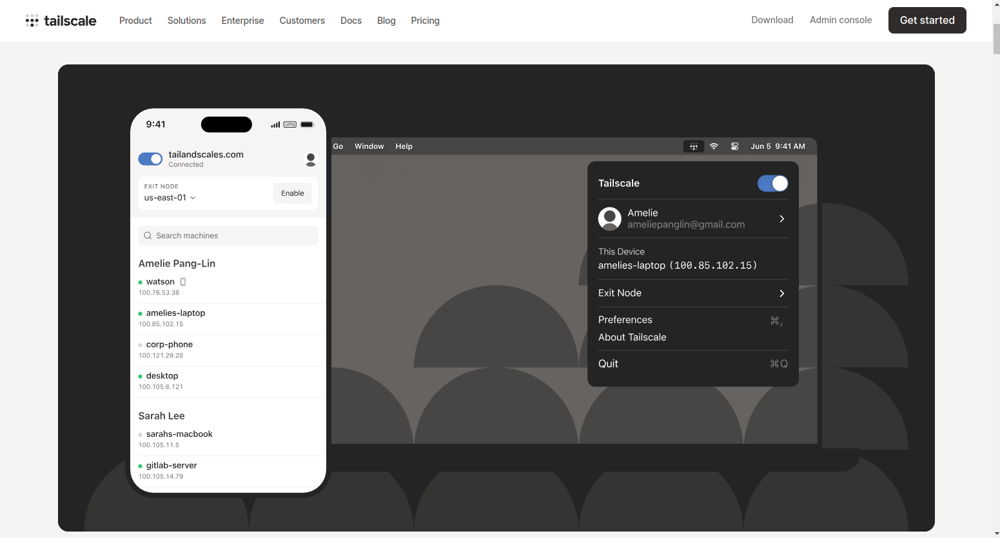

# Gruvy Drive

This is a project that is meant to be a very simple 'Google Drive' clone. I had the idea to make a web app that i could use to store and retrieve certain documents from anywhere.

Right now the project runs on node, I have a very simple express app that will allow the user to upload and download files from a specific directory on the server, as well as delete files from that directory.

Right now my goal is to add functionality to allow the downloading of youtube videos that will show up in the drive. I have a python video downloader that would be called when the user provides a url or search terms. The video would get downloaded into the server drive directory and then the user would be able to download that video directly.

## Authorization

Right now there is no authorization or any kind of 'security' because the server running this app is not exposed to the open internet. This app works through the use of a VPN, right now I use Tailscale to connect to this app from anywhere.

As the app stands right now, it does work and you could use it, but you would need to use a VPN if you want to access the drive from outside of the network the app is running on. You could run it exposed to the internet, but that could theoretically allow anybody to upload, view, and delete files your drive directory.

## How to use

1. Clone the repo
2. Run the app
```bash
node index.js
```
3. Connect to the app.
From the same computer (the app runs on port 8080 by default)
"localhost:8080"

From a different computer on the same network
"<ip addr of computer running the app>:8080"

With a VPN like tailscale
"<ip assigned in VPN>:8080"




