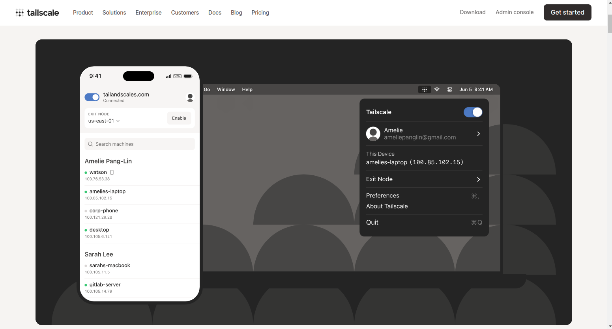

# Gruvy Drive

Gruvy Drive is a simple 'Google Drive' clone, designed to store and retrieve documents from anywhere. The project runs on Node.js, featuring a basic Express app that allows users to upload, download, and delete files from a specified server directory.

## Features

- **File Upload**: Upload files to the server directory.
- **File Download**: Download files from the server directory.
- **File Deletion**: Delete files from the server directory.
- **YouTube Video Downloader**: Download YouTube videos directly into the server directory by providing a URL or search terms.

## Authorization and Security

Currently, there is no built-in authorization or security since the app is not exposed to the open internet. Access is controlled via a VPN (e.g., Tailscale). If the app is exposed to the internet, anyone could potentially upload, view, and delete files in the drive directory.

## How to Use

1. **Clone the repository**:
    ```bash
    git clone <repository-url>
    cd <repository-directory>
    ```

2. **Run the app**:
    ```bash
    node index.js
    ```

3. **Connect to the app**:

    - **From the same computer** (the app runs on port 8080 by default):
      ```
      http://localhost:8080
      ```

    - **From a different computer on the same network**:
      ```
      http://<IP-ADDRESS-OF-COMPUTER-RUNNING-APP>:8080
      ```

    - **Using a VPN like Tailscale**:
      ```
      http://<VPN-ASSIGNED-IP>:8080
      ```

## Example



